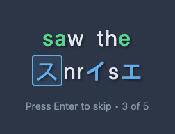
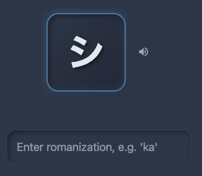

# 📚 KanaReader 📚

KanaReader is a modern, interactive web application that makes learning Katakana, Hiragana, and Kanji characters engaging and effective. The key feature if using Japanese characters in the context of english to learn the alphabet most effectively.

## ✨ Features

### 🎯 Follows Established Learning Principles

- **Progressive Disclosure**: New concepts build on mastered foundations
- **Contextual Learning**: Characters are practiced within meaningful sentences
- **Active Recall**: Typing responses (not multiple choice) strengthens memory pathways
- **Immediate Feedback**: Instant visual and audio confirmation of correct answers
- **Spaced Repetition**: Reviews are timed for optimal retention
- **Mixed Content**: Combines character recognition, pronunciation, and contextual sentence practice

### 🖊️ Learn using English as context

Transform sentences by typing English translations for highlighted Japanese characters:



In the example above you're knowledge of English will help you to piece together that the highlighted character is 'su' as you are learning.

Also mixed in are spaced repetition **Character Recognition** questions testing romanization and translation



### 📊 Progress Tracking

No login! Your progress is saved to your browser or you just jump to any level you like.


- Track progress within current level
- See overall progress across all character sets
- Jump between Katakana, Hiragana, and Kanji level sets

### 🔊 Pronounciations

Uses in-browser speech synthesis to provide japanese pronounciations

## 🚀 Getting Started

Just visit [kana.gpeake.com](kana.gpeake.com)

### Development Prerequisites

- Node.js (16+ recommended)
- npm or yarn

### Installation

1. **Clone the repository**

   ```bash
   git clone https://github.com/yourusername/kanakanareader.git
   cd kanakanareader
   ```

2. **Install dependencies**

   ```bash
   npm install
   ```

3. **Start the development server**

   ```bash
   npm run dev
   ```

## 📄 License

This project is licensed under the MIT License - see the [LICENSE](LICENSE) file for details.
